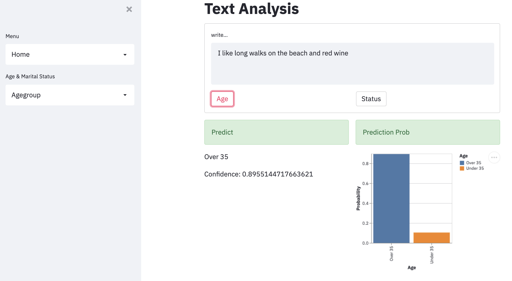
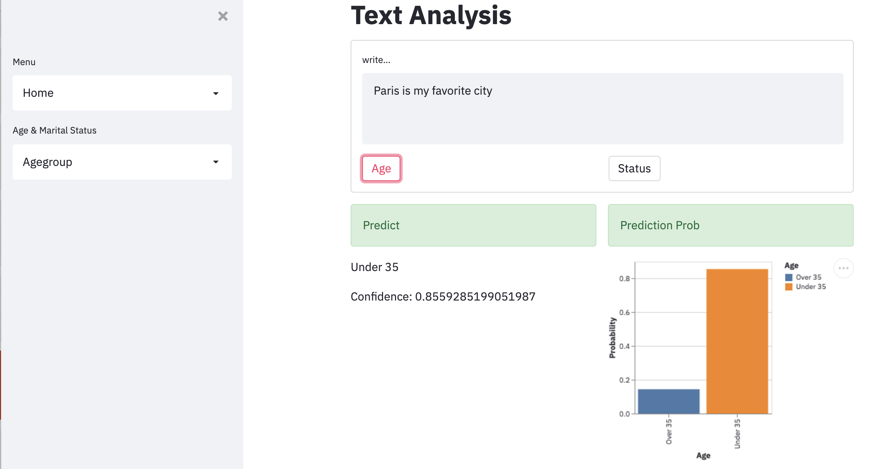

# Age and Relationsip Status Prediction With Artificial Intelligence: What Your Words Say About You

by Nadir Sarigul

[Click to see App](https://share.streamlit.io/dendar/okcupid_nlp_capstone/simple_streamlit_app.py)

## I. Overview and Goals

Advertising companies more and more rely on social media platforms to advertise their products, however it is becoming increasingly hard to target specific users with the appropriate products for their age and lifestyle. For example much of the advertising is nowadays done through instagram, facebook and twitter. Yet these platforms do not have specific demographic information about their users and when they do (in the case of facebook) it is optional so not everyone provides said information. Therefore, it is hard to advertise specific products that are preferentially used by specific demongraphics to the appropriate group of people.  In the age of social media, people’s inner lives are increasingly recorded through the language they use online in the different social media platforms. One's choice of words is a direct reflection of who they are, their experiences through life and their personality. In an effort to streamline how advertising companies tailor their ads to the appropriate demographics, this project is aimed at developing an artificial intelligence model to predict people's age and relationship status from written samples. To achive this, I stuctured this project to answer three main questions:

1) Are words used by people of distinct ages and relationship status different?

2) Can we predict age based on the way people speak/write?

3) Is it possible to accuratly predict the reltionship status from the assays one writes on dating profiles?

## II. Data Understanding and Exploration

This analysis is based off the OkCupid profile dataset from the Date-A-Scientist Project (Code Academy) which contains information from 59,946 OKCupid users. This dataset was scraped from active profiles of Bay Area users in 2012 and contains several layers of information on gender, sexual orientation, ethnicity, physical features, drinking, and drug habits as well as information on income, religion, and education level. It also contains a series of open ended free style written assays where each user writes about themselves in response to the following prompts:

- About Me / Self summary
- Current Goals / Aspirations
- My Golden Rule / My traits
- I could probably beat you at / Talent
- The last show I binged / Hobbies
- A perfect day / Moments
- I value / Needs
- The most private thing I'm willing to admit / Secrets
- What I'm actually looking for / Dating

Let's take a look at how the different users are distributed according to our variables of interest:

Looking at our data, we can see that in this dataset the age of the users varies from 18 to 69 years old, although the vast majority of users are within the 25-35 years old range and the average age of the users being 32 years old.

As expected, considering that this dataset was extracted from a datting app, the vast majority of users declare themselves as single with only a small portion indicating that they are in a relationship or are married.

We can see that there is a somewhat uneven amount of females and males in the dataset with about 2 females per 3 males and this difference seems to be similar amoung the different age groups.

## III. Text Data Preparation and Exploration

Our project focus on using written samples to develop a predictive model of age and marital status, thus it is vital that our algorithms can analyse text and understand the meaning of text. To do that, I will use natural language processing (NLP) which uses artificial intelligence principles to analyze, understand and ascribe meaning to text. 
Because language is messy and complex in order to be able to derive good models from text data, we have to do significant pre-processing of the data. My data had several null values because not all users wrote all the different assays. Since I did not want to loose data, and all the users in my dataset had at least written one assay, I proceeded with replacing null values with the string "missing value". Now that my data is complete and there are no null values left, I proceeded with cleaning the text in preparation for modeling. As part of the cleaning I removed the punctuation and the string that I had previously entered for missing values. I also removed stop words, which basically are very common words that appear in every sentence. These do not add much value and introduce noise. In addition, I also removed numbers and extra letters (eg. sssaaaaasssccsf). For simplicity, I also made the text all lower case. I used this cleaned data to start exploring what the effect of age and relationship status on the words used.

I used word clouds to visualize the most frequent words used by people in the different age groups and relationship status

### 18-35 years old

### 35+ years old

### Single

### In Relationships

## IV. Model

Machine learning models such as the ones that I am about to implement, can only take in numeric inputs. However, so far the data we want to use for modeling is words. The NLP toolbox has methods that can be used to process the text into numeric inputs that can be used by machine learning models. Here, I will use two different methods to convert text into numerical inputs to build different models. I will use Count Vectorization and Term Frequency-Inverse Document Frequency (Tfidf Vectorizer).The count vectorizater method counts the number of occurrences each words appears in a given written sample. On the other hand the Tfidf vectorizer calculates word frequency scores which not only takes into consideration the number of occurrences for each words in a given written sample but also how frequently it occurs in all written samples in the dataset. That helps highlighting the words that are more interesting (eg. frequent in a certain written sample but not across all written samples). 

In addition, my dataset does not provide a separate training and test dataset, so I splited the original dataset such that 70% of the data will be used for training and 30% of the data will be used for testing.

For the majority of the models I have decided to use the text samples that I had cleaned without the lematizing or nonsense words removal and have explored the text data produced using those additional cleaning steps only with the best model generated with the orginal cleaned data.

## Age Group

My final model to predict age groups from OKCupid data is a Logistic Regression Classifier using the clean version of the original data which is not lemmatized and still contains nonsense words. This model can accuratly predict 84% of the younger (18-35 years old) group, 76% of the older (35+) group and is overall 82% accurate.  This model seems to perform well as it is accurate and not super overfitted as seen by the fact that the training and test score are relatively close to each other (0.88 Testing Score and 0.82 Test Score). 

## Relationship Status

My final model to predict relationship from OKCupid data is a Multinomial Naive Bayes Classifier using the lemmatized version of the data but still containing nonsense words. This model can accuratly predict 84% of single people, 48% of people in a relationship and has an overall accuracy of 83%. Looking at the performance metrics, the model seems to perform ok and is not very ofverfitted as the training and test scores are similar (0.86 Training Score and 0.83 test Score).

## V. Dash App 

Using these models I have built a Dash app that predicts the age and relationship status based on a written sample. Below is are example of what a simple written sentence can tell about one's demographics

### For example if you are a wine lover...

### Or if your favorite city is Paris...

## VI. Conclusions  and Future Directions 

With the work that I have done so far with this project, I was able to answer the three questions that I put forward when I started the project and conclude the following:

1) Are words used by people of distinct ages and relationship status different?
This analysis shows that people of different age groups do have certain preferences for words and topics that are easy to recognize with artificial intelligence. On the other hand, it is harder to have a clear distinction between relationship status simply by looking at the words used. It is important to note however that this dataset comes from a dating app and therefore it is very bias towards people that are single or reported themselves as single even if they arent. It will be important to conduct a similar analysis and modeling with a dataset that is not bias towards single people to generate better conclusions about vocabulary choices of single versus people in a relationship. 

2) Can we predict age based on the way people speak/write?
This project also shows that we can accuratly predict age groups based on written samples with machine learning models.

3) Is it possible to accuratly predict the reltionship status from the assays one writes on dating profiles?
Similarly to the problem that I encountered with finding specifc word preferences and topics, building a model that accuratly predicts the relationship status based on this dataset proved to be complicated as the data is naturally bias towards people that identify themselves as single. As mentioned above, a future direction of this project will be to perform similar analysis with a dataset that is not related to dating so that the data is more representative of both relationship status and not noise is introduced by people that report being single when in reality they are not. 

## Business Recommendations

I started this project with the goal of developing a machine learning model that could be of use for advertisement agencies to screen their targets using written samples from social media (instagram comments, tweets etc). This model can be integrated within each advertising company's traditional platforms and implemented in an automatic way such that each individual is categorized onto a specific age group and/or relationship status thus helping to tailor what products should be advertised to a specific individual.

